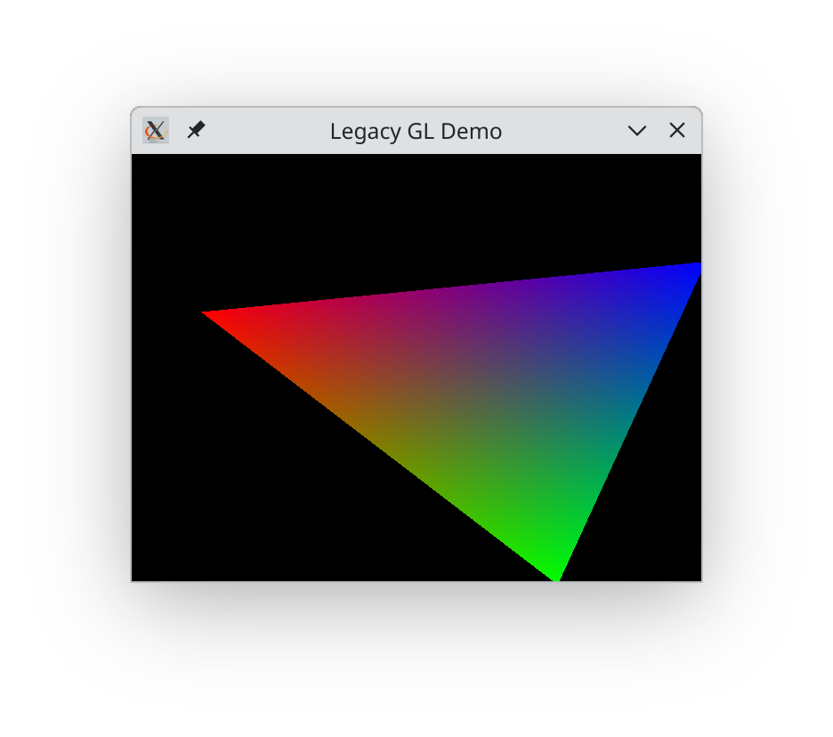
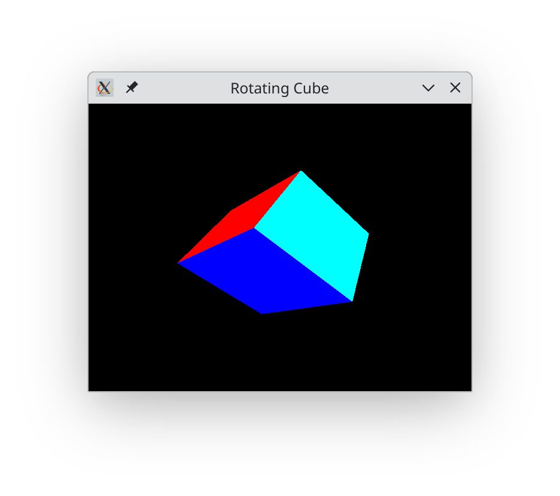

# gl-legacy

Legacy OpenGL immediate-mode bindings for OCaml

Use this together with `tgls` for a complete coverage of (more) modern OpenGL.

__Work in Progress__

## Examples

To run the demos:

* Make sure `tsdl` is installed, or run
```bash
opam install tsdl
```

* Then

```bash
mv bin/dune.moveme bin/dune
dune exec bin/triangle.exe
dune exec bin/cube.exe
dune exec bin/cube_lit.exe
dune exec bin/cube_list.exe
```





This one requires in addition `tsdl-image` and `tgls`:

```bash
cd bin; dune exec ./image_quad.exe
```

## Code sample

```ocaml
(...)

    Gl_legacy.gl_begin Gl_legacy.triangles;
    Gl_legacy.color3f 1.0 0.0 0.0;
    Gl_legacy.vertex2f 0.0 0.8;
    Gl_legacy.color3f 0.0 1.0 0.0;
    Gl_legacy.vertex2f (-0.8) (-0.8);
    Gl_legacy.color3f 0.0 0.0 1.0;
    Gl_legacy.vertex2f 0.8 (-0.8);
    Gl_legacy.gl_end ();

(...)
```

## But why?

* Why old openGL?

Because it's a lot easier to program, has some pedagogical value, and
allows me to run old code I wrote in the the good old times.

* But there's already `lablgl` and `glMLite`!

True. Good question. The goal is to have a minimal set of bindings
that would complement `tgls` (See the `image_quad` example).
